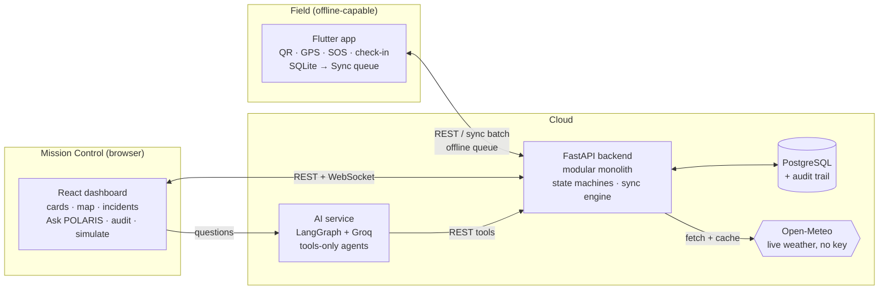
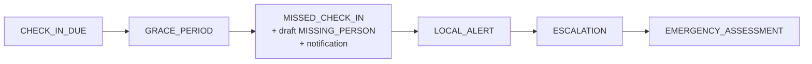
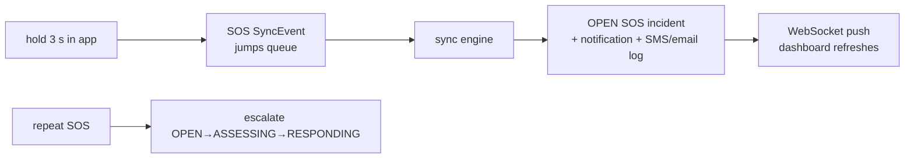
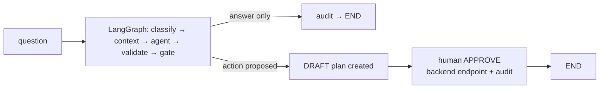

# POLARIS — Architecture & How It Works

**Integrated Polar Expedition Logistics and Asset Management System · SIH 2026, PS 26062**
**Demo identity:** `EXP-46ISEA-2026` → Bharati station · All demo data tagged `SYNTHETIC_DEMO`

---

## 1. System at a glance



Four deployables: **browser frontend** (Vercel static), **backend API** (long-lived host or serverless), **AI service** (long-lived host recommended), **PostgreSQL** (Neon). The Flutter app talks to the same backend API. There is exactly one source of truth — the database — and every quantity or status change flows through it via audited service functions.

### Tech stack

| Layer | Technology | Notes |
|---|---|---|
| Backend | FastAPI + SQLAlchemy + Alembic | Modular monolith: `models / schemas / routers / services` per domain |
| Database | PostgreSQL (SQLite for local rehearsal) | No PostGIS columns in use; portable DDL, 15 migrations |
| Frontend | React 18 + TS + Tailwind + MapLibre + OSM/Esri tiles | Hash routing, no rewrites needed on static hosts |
| Mobile | Flutter + sqflite + mobile_scanner | Offline-first sync queue, airplane-mode demo toggle |
| AI | LangGraph + LangChain + Groq `openai/gpt-oss-120b` | Tools call backend REST only; drafts need human approval |
| Weather | Open-Meteo | Keyless, cached as `WeatherSnapshot` rows |
| Docs/PDFs | ReportLab (templated) | Never freeform LLM text for official records |

---

## 2. Ground rules (enforced in code, not convention)

1. **State machines are server-side.** Cargo, readiness, mission, incident, asset and work-order transitions go through explicit allowed-transition tables; anything else is `409`.
2. **Inventory quantities are derived.** Application code never writes `quantity` directly — every change rides inside an `InventoryTransaction` row in the same commit.
3. **AI never touches the DB and never executes.** Tools are read-only REST calls (LLM path) or draft-creators (deterministic path). High-consequence actions need a human `APPROVE`, logged as an audit event.
4. **Everything is audited.** Every transition writes `AuditEvent`; logins write `UserSession`. The compliance UI reads these tables.
5. **Demo data is labeled.** Anything synthetic carries `source=SYNTHETIC_DEMO`.

---

## 3. Backend modules

```
backend/app/
├── main.py            # app factory, CORS, APScheduler tick, router wiring
├── config/            # Pydantic Settings (env-driven)
├── database.py        # engine + session (Postgres or SQLite via DATABASE_URL)
├── auth/              # bcrypt + JWT access/refresh, require_role() RBAC
├── models/            # 20+ tables (see §7)
├── schemas/           # Pydantic request/response contracts
├── routers/           # thin HTTP layer (~20 routers)
└── services/          # business logic + state machines + audit writes
```

| Domain | Key endpoints | State machine |
|---|---|---|
| Auth | `POST /auth/register·login·refresh·logout`, `GET /auth/me` | — (12 roles: ADMIN … AUDITOR) |
| Expeditions/Stations | `POST/GET/PATCH /api/v1/expeditions`, `GET /api/v1/stations` | `DRAFT→PLANNED→ACTIVE` |
| Personnel | `…/personnel`, `PATCH …/readiness`, `…/movements`, `readiness/summary` | 12-step linear chain ending `…→RETURNED→CLOSED_OUT` (close-out blocked by open incidents/ACTIVE missions) |
| Cargo | shipments→containers→packages→items, `POST /api/v1/scan`, compliance docs + PDF | 12 normal + 6 exception states; `VERIFIED→PACKED` requires declaration docs |
| Inventory | `GET /api/v1/inventory`, `POST …/transactions`, `GET …/{id}/history` | `OK/WATCH/CRITICAL` derived; over-issue rejected with available-stock math |
| Assets/Vehicles | CRUD + `PATCH …/status`, work orders | `PROCURED→…→IN_SERVICE⇄MAINTENANCE→RETIRED` |
| Field missions | CRUD, members, `POST …/go-no-go`, `PATCH …/status` | `DRAFT→…→DEPLOYED→ACTIVE→RETURNED→CLOSED`; DEPLOYED needs passing checks or Field-Leader override (audited) |
| Check-ins | `POST …/check-in`, `POST /check-ins/advance`, comms log | `DUE→GRACE→MISSED→LOCAL_ALERT→ESCALATION→EMERGENCY_ASSESSMENT` via 60 s worker; MISSED auto-drafts a `MISSING_PERSON` incident (never SOS) |
| Incidents/SOS | CRUD, `PATCH …/status`, `GET …/resources`, `POST /api/v1/sync/events` (SOS), `WS /api/v1/ws/alerts` | `OPEN→ASSESSING→RESPONDING→RESOLVED→CLOSED`; repeat SOS escalates; resource stub = available crew + IN_SERVICE spares |
| Notifications | `GET /api/v1/notifications`, read/ack, `GET /alerts/simulated` | Rules fire on stock-crossing, missed check-ins, SOS, delays, due maintenance (deduped) |
| AI endpoints | `GET /api/v1/ai/inventory-forecast`, plan drafts + decide, situation reports + publish | drafts are `DRAFT` until human `APPROVE`/`PUBLISH` |
| Closeout | `POST …/close`, `GET …/report(.pdf)`, expedition phase reports | mission `RETURNED→CLOSED` only when team accounted for + gear flagged |
| Audit | `GET /api/v1/audit/events(+/export)`, `/audit/sessions` | read-only over existing trail |
| Simulation | `POST /api/v1/simulate/*` (ADMIN) | drives real machines for rehearsals |
| Sync | `POST /api/v1/sync/events`, conflicts + resolve | idempotent receipts; combined offline over-issue → `SyncConflict` (ACTION REQUIRED) |

---

## 4. Critical flows

### Check-in escalation → draft incident


### SOS (offline-capable)


### AI ask → human approval (nothing self-executes)


### Offline sync conflict
Field tablet queues `INVENTORY_ISSUE` events → on reconnect the server sums them per item against live stock → fits: applied in order; overdraws: **neither applied**, one `SyncConflict` row → dashboard ACTION REQUIRED → human DISCARDs or APPLY_ANYWAYs.

---

## 5. AI layer (`ai/`)

- **15 REST tools** (`tools.py`): 8 reads + forecast + missions + incident-resources + 3 draft-only writes (alert advisory, work order, plan draft). Every call logged; caller's token forwarded so RBAC still applies.
- **Deterministic agents** (`agents.py`): keyword-routed LangGraph (logistics / inventory / emergency / report) with validator + approval gate; answers ship with `plan_draft_id` for the APPROVE button.
- **LLM agents** (`app/`): pinned `openai/gpt-oss-120b` factory (`llm.py`), `method="function_calling"` structured output (strict mode fails on this model), retry-then-"insufficient data" tool guard, five-agent graph with deterministic risk validator, checkpointed approval pauses (`graph.py`). New agents reuse this exact wiring.
- **Forecasting**: moving average (or EWMA) over outflow history; `reorder_point = rate × lead_time + safety_stock`, urgency-sorted stockout ETAs.

---

## 6. Frontend & mobile

- **Routes** (`/` landing with live backend health → `/login` → `/app/*` shell): Dashboard cards, Missions (Go/No-Go, deploy, check-ins, comms, closeout, report PDF), Cargo (shipments, packages, scan tester, docs), Inventory (transact, history, forecast), Personnel (readiness stepper), Incidents (live push + status flow), Map (stations real, teams/vehicles simulated), Ask POLARIS (APPROVE wiring), Situation Reports (publish gate), Audit & Compliance (filters + CSV), admin Simulation panel.
- **Mobile** (`mobile/`): every write becomes a `SyncEvent` row (`PENDING→UPLOADING→ACKNOWLEDGED`); QR scanner, offline issue/check-in forms, SOS hold-button with HIGH-priority queue jump, airplane toggle for the demo.

---

## 7. Data model (essentials)

`users`, `user_sessions`, `audit_events` · `stations`, `expeditions`, `route_legs` · `personnel`, `personnel_readiness_events` · `shipments`, `containers`, `packages`, `cargo_items`, `documents` · `inventory_items`, `inventory_transactions` · `assets`, `vehicles`, `maintenance_work_orders` · `field_missions`, `field_mission_members`, `field_check_ins`, `mission_comms` · `incidents` · `notifications`, `simulated_alerts` · `synced_events`, `sync_conflicts` · `plan_drafts`, `situation_reports`, `mission_reports`, `phase_reports`, `weather_snapshots`.

---

## 8. Run & deploy

- **Local rehearsal (SQLite):** `DATABASE_URL=sqlite:///./polaris_demo.db` → `alembic -c database/alembic.ini upgrade head` → `python database/seed/seed_demo.py` → backend `:8000`, AI `:8001`, frontend `:5173`. Demo logins use `polaris123`.
- **Production:** Postgres on Neon; backend + AI as long-lived hosts (Render recommended — scheduler and WebSockets work unmodified) or Vercel serverless (needs the `advance-cron` job and accepts no WS push); frontend static on Vercel with `VITE_API_URL`/`VITE_AI_URL` baked at build time. Full matrix in `docs/deployment.md`; 10-minute demo script in `docs/rehearsal.md`.
